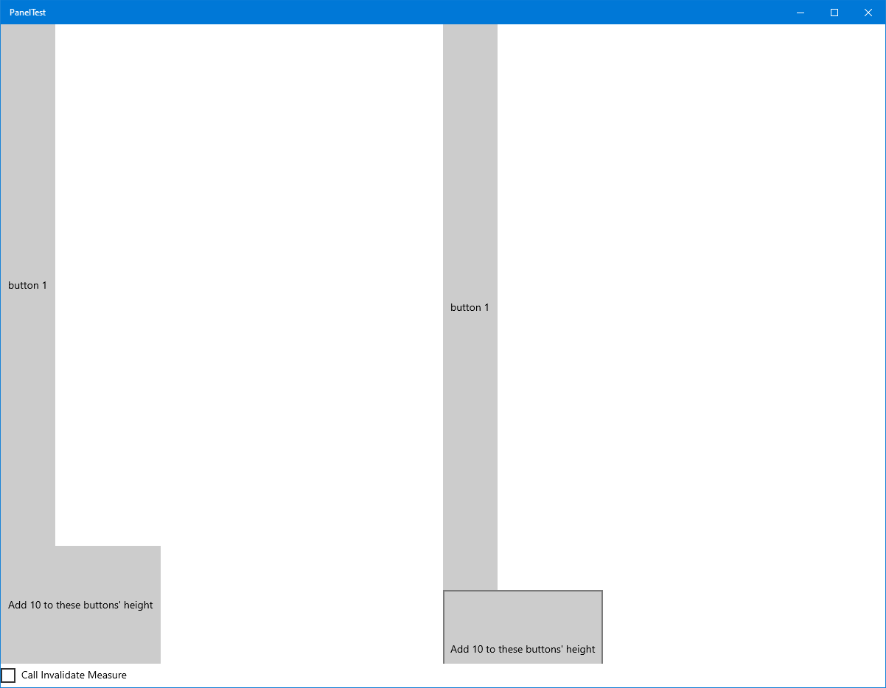

=== PanelTest ===

An example project for [https://stackoverflow.com/questions/67626789/how-does-a-stackpanel-know-when-to-re-layout](this) stackoverflow question.

The left side is a UWP Grid; the right side is a custom Panel-derived class using the Yoga library
for layout.  Click either of the two lower buttons and both buttons will have 10 added to their
height.

Without doing anything special, the Grid on the left resizes its contents automatically:

If I manually call InvalidateMeasure after changing the size, then things work correctly:

How does the Grid invalidate its measure/layout?
